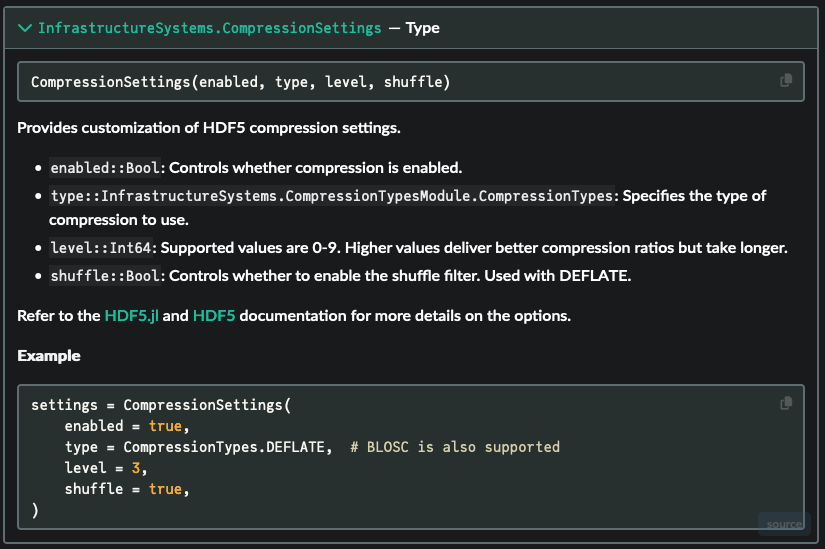
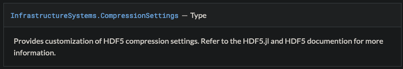

# Organize APIs and Write Docstrings

Docstrings for all structs, methods, and functions belong in the public or internal APIs,
organized under the [Reference](https://diataxis.fr/reference/) section in Diataxis organization.
Refer to this page particularly while editing Sienna docstrings and APIs for
guidance on common problems in our existing documentation.

## Prepare

  - If you have not read [Diataxis](https://diataxis.fr/), first read it in its entirety.
  - Refer back to the Diataxis [Reference](https://diataxis.fr/reference/) section while
    working.
  - Read and follow Julia's guidance on [Writing Documentation](@extref),
    which mainly applies to docstrings
  - Read the sections on `Documenter.jl`'s [`@docs` block](@extref) and
    [`@autodocs` block](@extref), and follow the guidance below on using `@autodocs`
    wherever possible

## Follow the Do's and Don't's

Julia and `Documenter.jl`'s guidance above should be your main reference, but in addition,
follow these do's and don't to avoid common pitfalls from previous versions of Sienna
documentation:

```@contents
Pages = ["write_docstrings_org_api.md"]
Depth = 3:3
```

### Look at the compiled .html!

!!! tip "Do"
    
      - [Compile](@ref "Compile and View Documentation Locally") regularly and
        look at the APIs
      - Check method signatures and argument lists are formatted correctly

### Ensure All Docstrings Are Located in the APIs

!!! tip "Do"
    
    Include a Public API markdown file for exported structs, functions, and methods, and an
    Internals API for private functions. See
    [`PowerSystems.jl`](https://nrel-sienna.github.io/PowerSystems.jl/stable/)
    for an example with a Public API organized with `@autodocs` ([see next](@ref use_autodocs))
    or [`SiennaTemplate.jl`](https://github.com/NREL-Sienna/SiennaTemplate.jl) for a basic
    template when starting a new package.

!!! tip "Do"
    
    Migrate all existing Formulation Libraries and Model Libraries into the Public API.

!!! tip "Do"
    
    If you want to make a docstring visible outside of the API (e.g., in a tutorial), use
    a [non-canonical reference](@extref noncanonical-block).

### [Automate Adding Docstrings in the Public API with `@autodocs`](@id use_autodocs)

!!! tip "Do"
    
    Use [`@autodocs` block](@extref)s in the Public API markdown file to automatically find
    all docstrings in a file. Example:
    
    ````markdown
    ## Variables
    ```@autodocs
    Modules = [SomeSiennaPackage]
    Pages = ["variables.jl"]
    Public = true
    Private = false
    ```
    ````

!!! warning "Don't"
    
    Manually list out the struts or methods on a topic in a [`@docs` block](@extref),
    because that introduces more work whenever we add something new or make a change.
    Example:
    
    ````markdown
    ## Variables
    ```@docs
    variable1
    variable2
    ```
    ````
    
    Consider re-organizing code if need be, so all related functions are in the same file(s)
    (e.g., `variables.jl`).

### [Selectively Export Docstrings from `InfrastructureSystems.jl`](@id docs_from_is)

If you are working in another Sienna package (e.g., `SomeSiennaPackage.jl`) that imports and
exports code from `InfrastructureSystems.jl`:

!!! tip "Do"
    
    List the files containing necessary `InfrastructureSystems.jl` structs and methods in
    `SomeSiennaPackage.jl`'s Public API markdown file, then explicitly filter by what
    `SomeSiennaPackage.jl` exports. Example:
    
    ````markdown
    ```@autodocs
    Modules = [InfrastructureSystems]
    Pages   = ["production_variable_cost_curve.jl", # examples
                "cost_aliases.jl",
            ]
    Order = [:type, :function]
    Filter = t -> nameof(t) in names(SomeSiennaPackage)
    ```
    ````

!!! warning "Don't"
    
    List `InfrastructureSystems` as one of the `modules` in [`Documenter.makedocs`](@extref)
    in the `make.jl` file. `Documenter.jl` will
    look to map **all** `InfrastructureSystems.jl` docstrings into the API, resulting in
    hundreds of [missing docstring](@ref miss_doc) errors. Example:
    
    ```julia
    makedocs(;
        modules = [SomeSiennaPackage, InfrastructureSystems],
        format = Documenter.HTML(;
            prettyurls = haskey(ENV, "GITHUB_ACTIONS"),
            size_threshold = nothing),
        sitename = "SomeSiennaPackage.jl",
        pages = Any[p for p in pages],
    )
    ```

### Ensure All Docstrings Have a Function Signature and Arguments List

!!! tip "Do"
    
    Check all exported docstrings have a function signature and detailed arguments list
    *visible in the API when you compile it*. Example:
    
    

!!! warning "Don't"
    
    Leave docstrings that just have a description unaddressed. Example:
    
    

### Automate Updating Docstring Arguments Lists

This is not commonly done in Sienna yet, but a goal is to improve our use of
[`DocStringExtensions.jl`](https://docstringextensions.juliadocs.org/stable) for automation:

!!! tip "Do"
    
    Use
    [`DocStringExtensions.TYPEDFIELDS`](https://docstringextensions.juliadocs.org/stable/#DocStringExtensions.TYPEDFIELDS)
    to automatically compile arguments lists. Example:
    
    ````markdown
    """
        SomeSiennaStruct(arg1, arg2)
    
    # Arguments
    $(TYPEDFIELDS)
    
    This is the docstring line.
    """
    struct SomeSiennaStruct <: OperationalCost
        "Documentation for argument 1"
        arg1::ProductionVariableCostCurve
        "Documentation for argument 2"
        arg2::Float64
    end
    ````

!!! warning "Don't"
    
    Copy and paste arguments lists into the docstring, which opens opportunity for
    out-of-date errors when arguments are added or reordered. Example:
    
    ````markdown
    """
        SomeSiennaStruct(arg1, arg2)
    
    This is the docstring line.
    
    # Arguments
      - `arg2::Float64`: Documentation for argument 2
      - `arg1::ProductionVariableCostCurve`: Documentation for argument 1
    """
    struct SomeSiennaStruct <: OperationalCost
        arg1::ProductionVariableCostCurve
        arg2::Float64
    end
    ````

### Add `See also` Links to Functions with the Same Name

!!! tip "Do"
    
    To help users navigate Julia's multiple dispatch, add `See also` paragraphs at the
    bottom of  function docstrings other versions of the function with the same name, using
    the guidance on [adding a specific hyperlink](@ref hyperlinks).
    Example:
    
    ```
    See also 
    [`get_time_series_array` by name from storage](@ref get_time_series_array(
        ::Type{T},
        owner::TimeSeriesOwners,
        name::AbstractString;
        start_time::Union{Nothing, Dates.DateTime} = nothing,
        len::Union{Nothing, Int} = nothing,
        ignore_scaling_factors = false,
        features...,
    ) where {T <: TimeSeriesData}),
    [`get_time_series_array` from a `StaticTimeSeriesCache`](@ref get_time_series_array(
        owner::TimeSeriesOwners,
        time_series::StaticTimeSeries,
        start_time::Union{Nothing, Dates.DateTime} = nothing;
        len::Union{Nothing, Int} = nothing,
        ignore_scaling_factors = false,
    ))
    ```

### Follow the Guidelines on Cleaning Up General Formatting

!!! tip "Do"
    
    Follow How-to [Clean Up General Formatting](@ref), especially by adding
    hyperlinks to other Sienna structs that appear within an arguments list.
